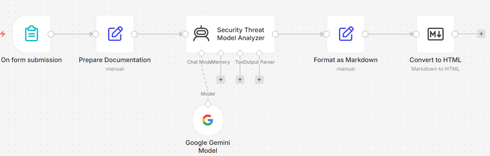

# **AI-Driven Security Threat Modeler & Documentation Engine**

## **Project Overview**
This project is an automated security orchestration pipeline designed to accelerate the **Threat Modeling** process. By leveraging **AI Agents** and low-code orchestration, the tool interprets technical system documentation to identify architectural vulnerabilities based on the **STRIDE framework** (Spoofing, Tampering, Repudiation, Information Disclosure, Denial of Service, and Elevation of Privilege).

The goal of this project is to eliminate documentation bottlenecks in **NOC** and **Cloud Engineering** environments by automatically generating "audit-ready" technical artifacts.

## **System Architecture**
The workflow is built in **n8n** and utilizes a multi-stage logic gate to ensure high-fidelity output:

1.  **Ingestion:** Data is received via a custom Form Trigger.
2.  **Preprocessing:** Technical specifications are structured for AI analysis.
3.  **Analysis:** A **Google Gemini-powered AI Agent** evaluates the system against STRIDE categories.
4.  **Transformation:** Findings are formatted into standardized **Markdown**.
5.  **Visualization:** The engine generates **Mermaid.js** code to visualize trust boundaries and data movement.

### **Workflow Visualization**


## **Sample Output**
The following is an example of the structured output generated by the engine.

### **1. Security Audit (Markdown)**
```markdown
# Threat Model Report: [System Name]
**Date:** 2026-05-06
**Framework:** STRIDE

## Critical Findings
### [T] Tampering - Data In-Transit
- **Threat:** Potential intercept of unencrypted telemetry data between the edge node and the cloud gateway.
- **Mitigation:** Implement TLS 1.3 for all egress traffic.

### [E] Elevation of Privilege - API Gateway
- **Threat:** Weak validation on JWT claims could allow a standard user to access administrative endpoints.
- **Mitigation:** Enforce strict role-based access control (RBAC) and signature verification.
